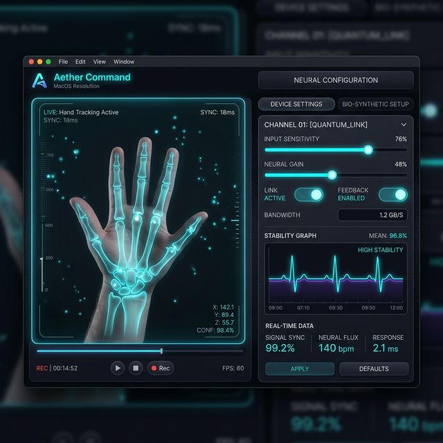

#  Project: Aether-Command

### *The Premium Gestural Controller for macOS*

Aether-Command is a native macOS application that brings the future of interaction to your desktop. By leveraging the **Aether-Hands** engine, it allows you to control your system, media, and spaces with intuitive hand gestures—no touch required.

---

## 🔥 Key Features

- 🖥️ **Glassmorphic Dashboard**: A stunning, modern UI that feels native to macOS, allowing for real-time tracking visualization.
- ⚙️ **Customizable Mappings**: Map gestures (Pinch, Fist, Palm, Swipe) to specific system actions:
  - **Media Control**: Play/Pause, Volume.
  - **System Navigation**: Mission Control, Desktop Spaces.
- 📉 **Smoothing & Sensitivity**: Adjust the tracking response to fit your lighting and environment.
- 🚀 **Background Service**: Runs as a lightweight menu-bar app, staying out of your way until needed.
- 🔐 **Privacy First**: All processing happens locally on your machine.

---

## 🛠️ Installation & Setup

### 📦 Prerequisites
- **macOS** (Optimized for Apple Silicon & Intel)
- **Node.js** (v18+)

### 🚀 Running Local Development
```bash
# Install dependencies
npm install

# Start the application
npm start
```

### 🏗️ Production Build
```bash
# Generate a native .dmg or .app
npm run dist
```

---

## 🔐 Permissions & Privacy

Aether-Command requires several macOS permissions to function as a system controller:

1. **Camera**: Used strictly for real-time hand landmark detection. No images or videos are ever saved or transmitted.
2. **Accessibility**: Required to simulate system-level keystrokes (like switching Spaces or controlling volume).
3. **Automation**: Needed to communicate with apps like Spotify or Music.

> [!NOTE]
> Upon first launch, the app will automatically prompt you for these permissions. You can also manage them in **System Settings > Privacy & Security**.

---

## 🏗️ Technical Architecture

- **Engine**: MediaPipe Hand Landmarker via `@mediapipe/tasks-vision`.
- **UI Layer**: Electron Renderer with CSS Glassmorphism.
- **System Bridge**: Node.js IPC + AppleScript (`osascript`).
- **Language**: 100% TypeScript.

---

*Part of the [Aether Ecosystem](../README.md)*
